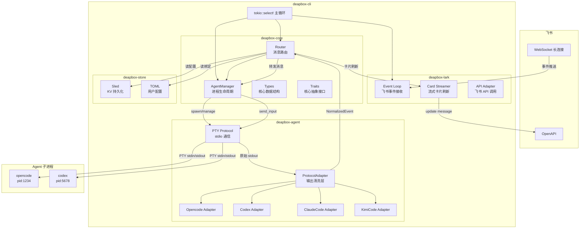
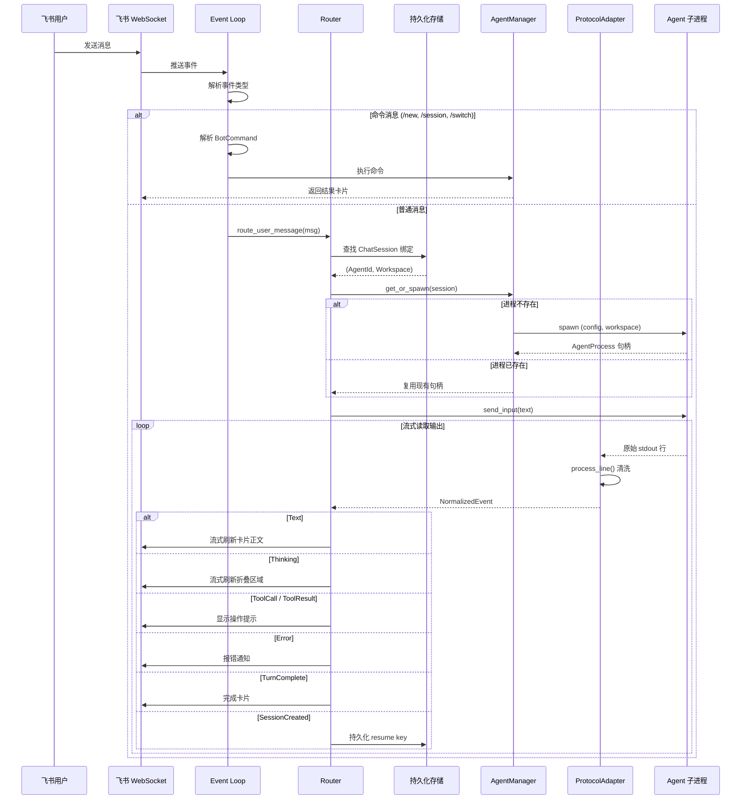
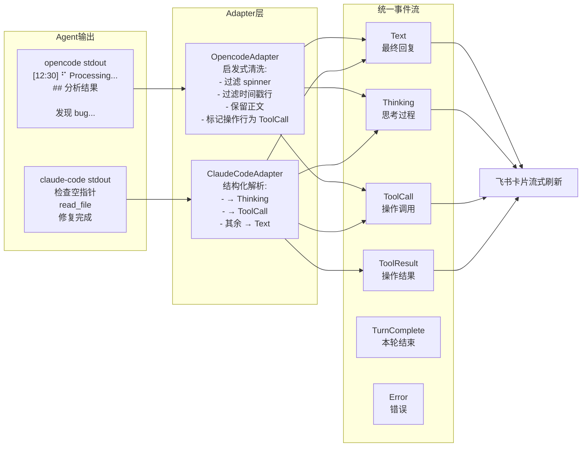
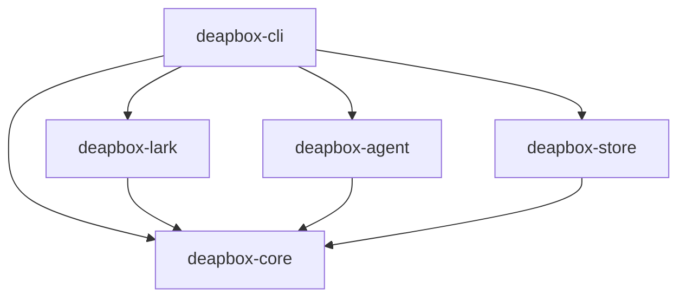
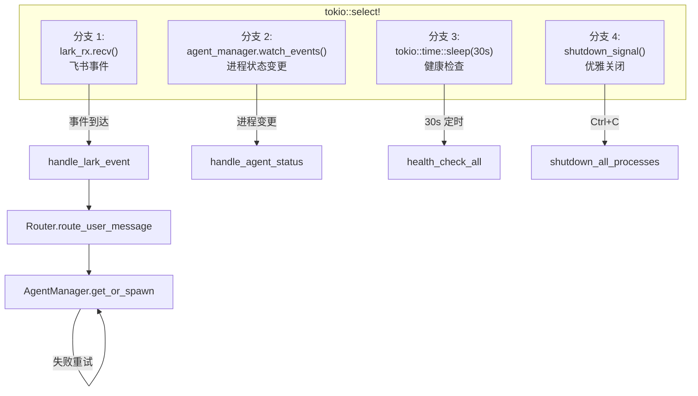
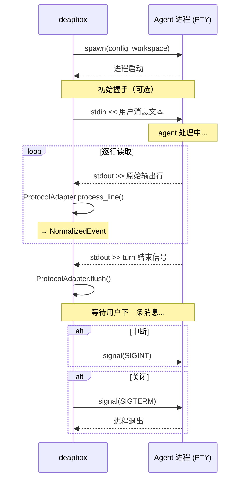

# deapbox 架构图

## 1. 整体系统架构



## 2. 消息路由流程



## 3. Agent Adapter 数据处理流



## 4. 组件依赖关系



## 5. 主循环事件调度



## 6. PTY 通信协议



## 7. Crate 文件结构

```
deapbox/
├── Cargo.toml                         # [workspace]
├── ARCHITECTURE.md                    # 本文档
│
├── deapbox-core/                      # 领域核心（零依赖外部）
│   ├── Cargo.toml
│   └── src/
│       ├── lib.rs
│       ├── types.rs                   # 类型定义（28 loc）
│       ├── traits.rs                  # trait 定义（36 loc）
│       ├── router.rs                  # 消息路由（stub）
│       └── agent_manager.rs           # 进程管理（stub）
│
├── deapbox-lark/                      # 飞书适配
│   ├── Cargo.toml
│   └── src/
│       ├── lib.rs
│       ├── event.rs
│       ├── api.rs
│       ├── card.rs
│       └── types.rs
│
├── deapbox-agent/                     # Agent 协议适配
│   ├── Cargo.toml
│   └── src/
│       ├── lib.rs
│       ├── protocol.rs               # PTY stdio 通信
│       ├── adapter.rs                # ProtocolAdapter trait + NormalizedEvent
│       ├── opencode.rs               # Opencode 适配
│       ├── codex.rs                  # Codex 适配
│       ├── claude_code.rs            # ClaudeCode 适配
│       └── kimi_code.rs             # KimiCode 适配
│
├── deapbox-store/                     # 持久化
│   ├── Cargo.toml
│   └── src/
│       ├── lib.rs
│       ├── store.rs                  # sled 实现
│       └── config.rs                 # TOML 解析
│
└── deapbox-cli/                       # 二进制入口
    ├── Cargo.toml
    └── src/
        ├── main.rs
        └── config.toml
```
