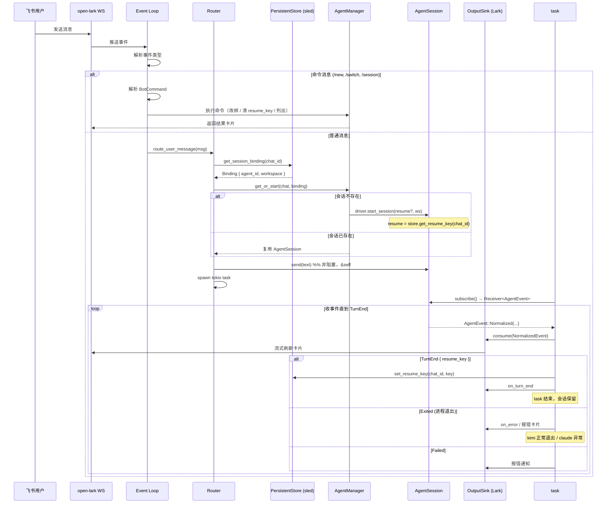
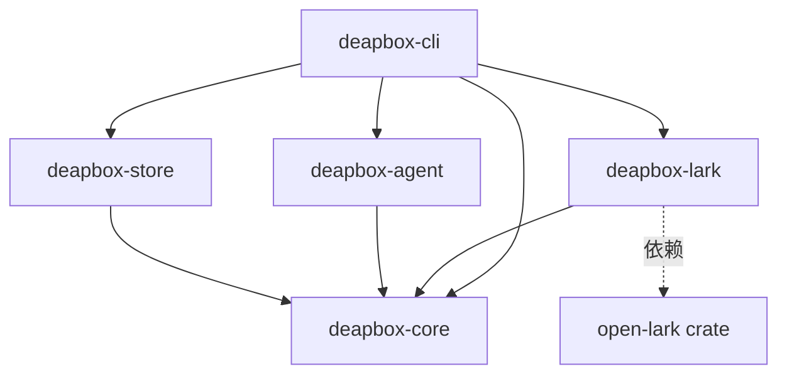
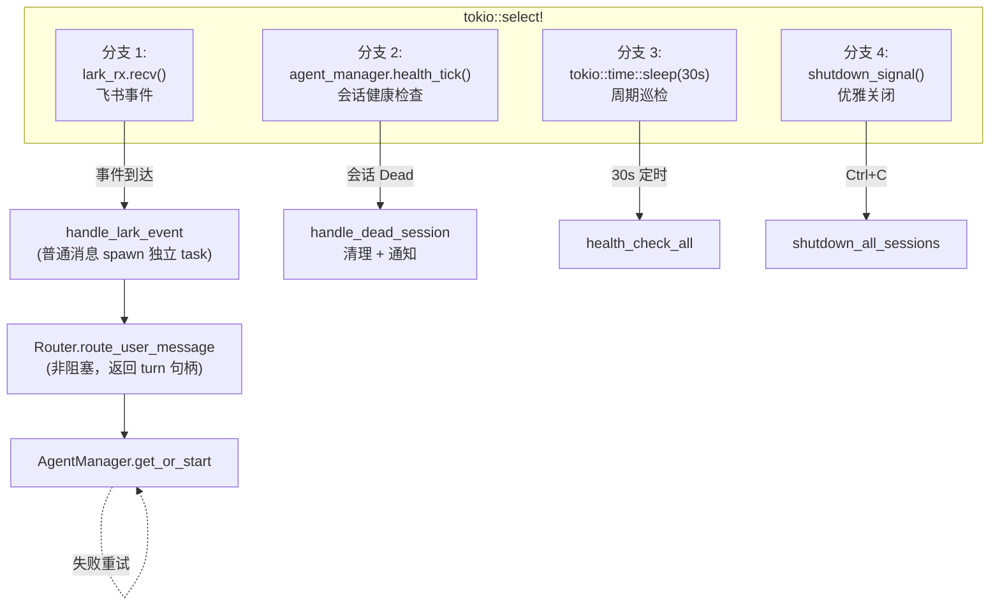

# deapbox 架构图

> 本文档描述 deapbox 的**目标架构**。部分 crate 仍为 stub，按 [working.md](./working.md) 推进实现。
> 设计基线经 issue **TES-77** 的 grill 会话锁定（线程 `c1ed9ab0`），四项核心决策见下表。

## 设计基线（四项锁定决策）

| 决策 | 要点 |
|---|---|
| **并发模型** | Router 不阻塞；每条用户消息 spawn 一个独立 tokio task；task 拥有 `AgentSession` 句柄 + 事件接收端；不再用 `Arc<dyn AgentProcess>` 共享可变进程 |
| **协议 / turn-end** | 驱动 agent 进原生 `--output-format stream-json`；turn-end = `result` JSON 事件（过滤 `subtype: compact/compaction` 的中途压缩通知）；idle-timeout 仅作 dead-agent 安全网；EOF ≠ TurnComplete |
| **session / 存储** | `chat_id` 即 session 主键（一 chat 一绑定，不多线程）；`ChatSession` 为纯绑定 `{chat_id, agent_id, workspace}`；`PersistentStore` 的 binding 含 workspace（修缝）+ `resume_key` 独立 KV；`AppConfig.sessions` 降级为首启 seed；不用 `--continue` |
| **driver trait** | 两层 trait：`AgentDriver`（工厂 per-kind）+ `AgentSession`（运行，`subscribe() -> Receiver<AgentEvent>`，`TurnEnd`/`Exited` 在流里）；per-kind own 进程生命周期（claude-code 长驻 / kimi 进程-per-turn）；`respond_permission` defer |

---

## 1. 整体系统架构

```mermaid
graph TB
    subgraph "飞书 (Lark)"
        LarkWS[WebSocket 长连接<br/>open-lark]
        LarkAPI[OpenAPI<br/>open-lark]
    end

    subgraph "deapbox-cli"
        MainLoop["tokio::select! 主循环"]

        subgraph "deapbox-core"
            Router["Router<br/>task-per-message 路由"]
            AgentMgr["AgentManager<br/>会话表 Map&lt;ChatId, Box&lt;dyn AgentSession&gt;&gt;"]
            Types["Types<br/>ChatSession / AgentEvent / ..."]
            Traits["Traits<br/>AgentDriver / AgentSession / OutputSink / PersistentStore"]
        end

        subgraph "deapbox-lark (薄适配层, 基于 open-lark)"
            LarkEvent["Event Loop<br/>飞书事件 → UserMessage/BotCommand"]
            LarkCard["Card Streamer<br/>OutputSink 实现"]
            LarkSDK["open-lark client<br/>不自研 HTTP/WS/卡片"]
        end

        subgraph "deapbox-agent"
            Driver["AgentDriver (per-kind)<br/>注入 stream-json flag"]
            Session["AgentSession<br/>subscribe() → Receiver&lt;AgentEvent&gt;"]
            CC["ClaudeCodeSession<br/>长驻 stream-json"]
            KC["KimiSession<br/>进程-per-turn + --resume"]
        end

        subgraph "deapbox-store"
            SledDB["Sled<br/>binding:{chat_id} + resume:{chat_id}"]
            TomlConfig["TOML config<br/>首启 seed"]
        end
    end

    subgraph "Agent 子进程"
        CCProc["claude (长驻)<br/>pid:1234"]
        KCProc["kimi (per-turn)<br/>--resume"]
    end

    LarkWS -->|事件推送| LarkEvent
    MainLoop --> LarkEvent
    MainLoop --> Router
    MainLoop --> AgentMgr

    Router -->|读 binding| SledDB
    Router -->|读 resume_key| SledDB
    Router --> AgentMgr

    AgentMgr -->|start_session| Driver
    Driver -->|spawn + stream-json flag| CCProc
    Driver -->|spawn + --resume| KCProc

    Router -->|转发消息| AgentMgr
    AgentMgr -->|send(&self)| Session
    Session -->|subscribe() Receiver| Router
    CC --> Session
    KC --> Session

    Router -->|OutputSink.consume| LarkCard
    LarkCard -->|update message| LarkAPI
```

## 2. 消息路由流程



## 3. Agent 事件流（stream-json 解析）

```mermaid
flowchart LR
    subgraph Agent输出["Agent stdout (NDJSON, 一行一个 JSON 对象)"]
        Line1["{\"type\":\"assistant\",...}"]
        Line2["{\"type\":\"result\",\"session_id\":\"s_xxx\",...}"]
        Line3["{\"type\":\"result\",\"subtype\":\"compact\",...}"]
    end

    subgraph 解析层["per-kind AgentSession 读循环"]
        Parse["按 raw[\"type\"] 分派<br/>不抓裸文本，不做 spinner/ANSI 清洗"]
        Filter["compaction 过滤<br/>subtype=compact/compaction ≠ TurnEnd"]
    end

    subgraph 统一事件流["AgentEvent (Receiver)"]
        N["Normalized(Text/Thinking/ToolCall/ToolResult)"]
        TE["TurnEnd { resume_key }"]
        Ex["Exited (Option<i32>)"]
        F["Failed (CoreError)"]
    end

    Line1 --> Parse --> N
    Line2 --> Parse --> TE
    Line3 --> Filter -.不发射.-> TE
    Parse --> Ex
    Parse --> F

    N --> Sink["OutputSink → Lark 卡片"]
    TE --> Sink
```

## 4. 组件依赖关系



## 5. 主循环事件调度



> 关键：Router `route_user_message` **不阻塞主循环**——普通消息 spawn 独立 tokio task 处理整轮，主循环继续接收下一个飞书事件，多群并发天然成立。

## 6. stream-json 通信协议

```mermaid
sequenceDiagram
    participant D as deapbox (AgentSession)
    participant P as Agent 进程 (stdio)

    D->>P: spawn(cmd + --output-format stream-json [--resume key])
    P-->>D: 进程启动

    D->>P: stdin << 用户消息 (claude: stream-json input; kimi: --prompt)
    Note over P: agent 处理中...

    loop 逐行读 stdout (NDJSON)
        P-->>D: stdout >> {"type": "...", ...}
        D->>D: serde_json 解析 + 按 type 分派
        Note over D: → AgentEvent::Normalized / TurnEnd / Exited
    end

    P-->>D: stdout >> {"type":"result","session_id":"..."}
    D->>D: 发 AgentEvent::TurnEnd{resume_key}
    D->>Store: set_resume_key(chat_id, key)

    Note over D,P: 长驻 agent (claude): 等下一条消息; per-turn agent (kimi): 进程退出 → Exited

    alt 中断
        D->>P: interrupt() (SIGINT via nix, &self)
    end

    alt 关闭
        D->>P: close() (kill_on_drop 兜底)
    end
```

> turn-end 是 agent **自己说的**（`result` 事件），不是 deapbox 猜的（非 idle-timeout / 非 EOF）。
> `result` 带 `subtype: compact|compaction` 是**中途压缩**，不是完成，必须过滤（否则拦腰切断长任务）。

## 7. Crate 文件结构

```
deapbox/
├── Cargo.toml                         # [workspace]
├── docs/
│   ├── ARCHITECTURE.md                # 本文档
│   └── working.md                     # changelog + lesson learned
│
├── deapbox-core/                      # 领域核心（零外部依赖）
│   ├── Cargo.toml
│   └── src/
│       ├── lib.rs
│       ├── types.rs                   # ChatSession(纯绑定) / AgentEvent / NormalizedEvent / ...
│       ├── traits.rs                  # AgentDriver / AgentSession / Router / AgentManager / OutputSink / PersistentStore
│       ├── router.rs                  # task-per-message 路由
│       └── agent_manager.rs           # 会话表
│
├── deapbox-lark/                      # 飞书适配（基于 open-lark，不自研底层）
│   ├── Cargo.toml                     # 依赖 open-lark，无 reqwest/tungstenite
│   └── src/
│       ├── lib.rs
│       ├── event.rs                   # 事件 → UserMessage/BotCommand
│       ├── api.rs                     # open-lark client 封装
│       ├── card.rs                    # OutputSink 实现
│       └── types.rs
│
├── deapbox-agent/                     # Agent 协议适配
│   ├── Cargo.toml
│   └── src/
│       ├── lib.rs
│       ├── protocol.rs                # stdio spawn 共享工具
│       ├── adapter.rs                 # stream-json NDJSON 解析 + compaction 过滤
│       ├── claude_code.rs             # ClaudeCodeSession（长驻 stream-json）
│       ├── kimi_code.rs               # KimiSession（进程-per-turn + --resume）
│       ├── opencode.rs                # （stub / 后续）
│       └── codex.rs                   # （stub / app-server 模式后续）
│
├── deapbox-store/                     # 持久化
│   ├── Cargo.toml
│   └── src/
│       ├── lib.rs
│       ├── store.rs                   # sled: binding{chat_id}+workspace / resume{chat_id}
│       └── config.rs                 # TOML 解析（sessions 仅 seed）
│
└── deapbox-cli/                       # 二进制入口
    ├── Cargo.toml
    └── src/
        ├── main.rs                    # 装配 + tokio::select! + --check-config/--dry-run
        └── config.toml
```
